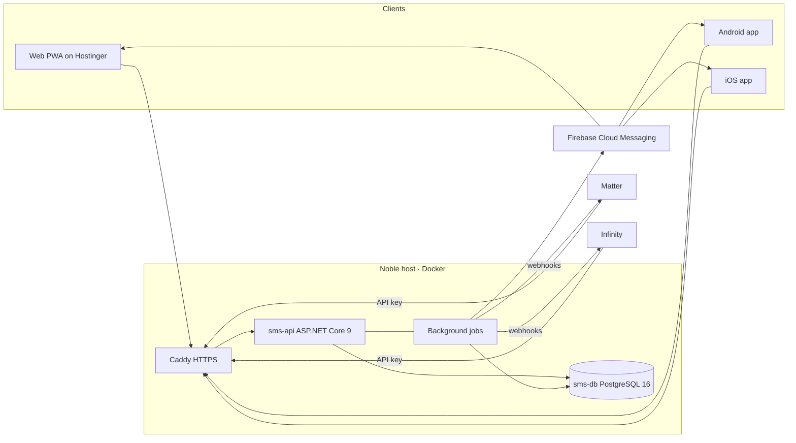

# 01 · Architecture

## Goals

1. Any BU staff member can log opening and closing stock in under two minutes from a phone.
2. Consumption is never entered by hand. It is derived from counts and the movement ledger, and only `super_admin` can see it.
3. Reagents are tied to instruments, so a BU's count sheet is generated from the instruments it owns.
4. Weekly and monthly opening/closing figures are frozen and auditable.
5. Everything recorded is exportable through a stable, keyed API for Matter and Infinity.

## Stack

| Layer | Choice | Why |
| --- | --- | --- |
| API | ASP.NET Core 9 minimal API, Npgsql + Dapper, numbered SQL scripts | Same shape as Infinity (`Endpoints/` per domain, repository per domain, `db/sql` + `apply.ps1`), so one team maintains both. No ORM. |
| Database | PostgreSQL 16 in Docker, own volume | Isolated from Noble (disk is tight there, and this data must not live in the LIS DB). JSONB for audit/webhook payloads, `NULLS NOT DISTINCT` unique indexes for the per-instrument item rows. |
| Jobs | .NET `BackgroundService` inside the API container | Reminder scheduling, missed-count escalation, nightly snapshot build, webhook delivery with retry. No separate worker until load demands it. |
| Web | React 18 + Vite + TypeScript, react-router v6, TanStack Query, vite-plugin-pwa | Installable PWA on desktop and Android. Same code becomes the mobile app. |
| Mobile | Capacitor 6 wrapping `web/dist` | Real store apps for Android and iOS with native push and local notifications. iOS web push requires home-screen install and is unreliable for reminders, so the store build is the supported iOS path. |
| Push | Firebase Cloud Messaging (Android + web), APNs via FCM (iOS) | One send API from the backend. |
| Auth | JWT access token (15 min) + rotating refresh token (30 days) stored per device; API keys for integrations | The frontend is on a different origin (Hostinger) and the mobile app has no cookie jar, so bearer tokens rather than Infinity's cookie JWT. |
| Reverse proxy | Caddy (auto HTTPS) in the compose stack | Public hostname for the API, e.g. `sms-api.genomicslab.in`, exposed the same way the Infinity staging port is. |

## Components



## API project layout

```
api/
  src/Sms.Api/
    Program.cs                 host, auth, CORS, OpenAPI, health
    Auth/                      JWT issue/refresh, API-key handler, Roles.cs (capability sets), Scope.cs
    Endpoints/                 one file per domain: Auth, BusinessUnits, Instruments, Catalogue,
                               Stock (counts, lots, movements, levels), Reminders, Devices,
                               Reports (super_admin only), Admin, Export (integration), Webhooks
    Data/                      Db.cs (connection factory), repositories per domain, SQL in .sql resources
    Jobs/                      ReminderScheduler, MissedCountEscalator, SnapshotBuilder, WebhookDispatcher
    Push/                      FcmClient
    Contracts/                 request/response records (shared shape with web/src/api/types.ts)
  db/
    sql/001_schema.sql ...     numbered, idempotent where possible
    apply.ps1                  applies scripts in order, records in sms_migration
  Dockerfile
```

## Web project layout

```
web/
  src/
    app/            router, providers, shell (top bar, BU switcher, bottom nav on mobile)
    api/            typed client, query hooks, auth store, token refresh
    features/
      today/        Today dashboard: opening + closing cards, alerts
      count/        Count sheet (the core screen), submit, variance review
      stock/        Levels, lots, receipts, wastage, transfers
      instruments/  BU instruments and their reagent lists
      catalogue/    Items, instrument models, suppliers (admin)
      reminders/    Reminder config, device registration
      reports/      Consumption analytics, period snapshots (super_admin)
      admin/        Users, BUs, API keys, audit
    ui/             design system components and tokens
    pwa/            service worker registration, push subscription
mobile/
  capacitor.config.ts, android/, ios/   (webDir points at ../web/dist)
```

## Key design decisions

### Counts are facts, consumption is derived
`stock_count` rows store what the tech physically counted. Nothing in the UI asks "how much did you use".
Daily consumption for a `bu_item` on date D:

```
consumed(D) = opening(D) + receipts(D) - wastage(D) - transfers_out(D) + transfers_in(D) + adjustments(D) - closing(D)
```

Counts are stored in the item's **base unit** (test, mL, piece). The count sheet lets the tech enter
`packs + loose` and converts using `item.pack_size`.

### Opening is prefilled from the previous closing
When an opening count is opened for date D, every line is prefilled with `closing(D-1)` (or the last known
count) as `expected_qty`. The tech confirms or corrects. A variance beyond the BU's tolerance is highlighted
and requires a note, but never blocks submission. This keeps overnight discrepancies visible without slowing
the morning routine.

### Instrument-specific reagents
`instrument_model` (Sysmex XN-550, Roche cobas c311 ...) owns catalogue items via `item.instrument_model_id`.
A BU owns `instrument` rows. When a BU adds an instrument, the app proposes the model's reagent list as new
`bu_item` rows, each linked to that physical instrument. Two instruments of the same model in one BU get
separate `bu_item` rows so their consumption can be compared.

### Movement ledger
Receipts, wastage, transfers and adjustments are `stock_movement` rows with a signed `qty_delta`. Current
stock for a `bu_item` = last count qty + sum of movements since that count. This is exposed as
`v_current_stock` and drives low-stock and expiry alerts.

### Period snapshots
A nightly job builds `period_snapshot` rows for the running week (Mon-Sun) and month per `bu_item`:
opening = first opening count in the period (or carried closing), closing = latest closing, plus summed
movements and derived consumption. `super_admin` locks a period; locked snapshots are immutable and any
later edit to underlying counts needs an explicit unlock, which is audited.

### Reminders and notifications
Reminders are configured per BU (optionally per user). Delivery has two legs:

1. **Device-local**: the app syncs reminder config and schedules local notifications on the device
   (Capacitor Local Notifications; web uses the service worker). Works with no connectivity.
2. **Server push**: the `MissedCountEscalator` job checks, after `closing_due_time + grace`, whether a
   submitted count exists; if not it pushes to the BU's techs, then to the manager after
   `escalate_after_minutes`. Weekly review and monthly close reminders are server-sent.

### Consumption visibility
Consumption values are computed only in `Reports` and `Export` repositories, and those endpoints require
`super_admin` or an API key with the `export:consumption` scope. No count or level endpoint returns a
consumed figure, and the web bundle contains no consumption UI outside the `reports/` feature, which is
route-guarded and also hidden from navigation for other roles.

### Audit
Every write goes through a repository method that also inserts an `audit_log` row (actor, action, entity,
before/after JSONB). Count submission, reopen, period lock/unlock, catalogue edits and API key changes are
all covered.

### Integration surface
Matter and Infinity pull with `GET /export/v1/*?updated_since=` (cursor paginated) or subscribe to webhooks
(`count.submitted`, `movement.created`, `snapshot.locked`). Payloads are versioned; breaking changes go to
`/export/v2/`. See `03-api.md`.
