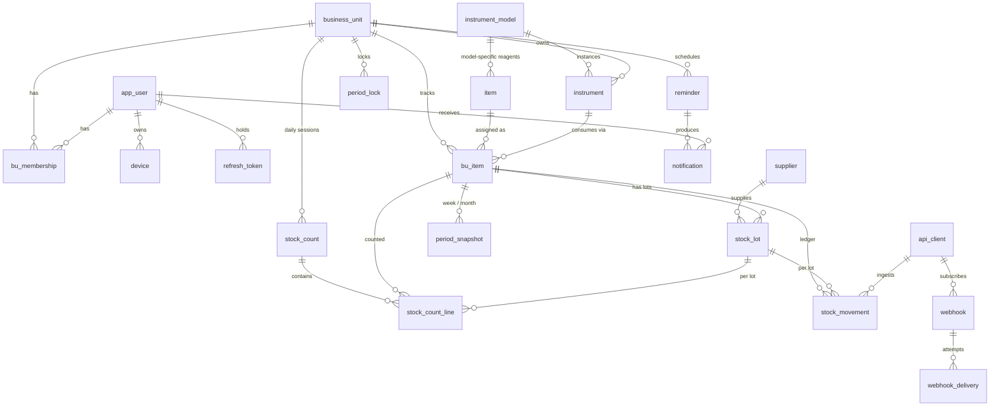

# 02 · Database

PostgreSQL 16. DDL lives in [db/sql/001_schema.sql](../db/sql/001_schema.sql). Every quantity is stored in the
item's **base unit** as `numeric(14,3)`; packs are a display convenience.

## ERD

## Table groups

### Organisation
| Table | Purpose | Notes |
| --- | --- | --- |
| `business_unit` | A lab, collection centre or store that keeps stock | Carries its own timezone, opening/closing due times, grace and variance tolerance so reminders and variance checks are per BU. |
| `app_user` | Staff login | One `role`. `session_version` bump revokes all tokens. |
| `bu_membership` | Which BUs a non-admin user belongs to | Composite PK. `is_default` picks the BU shown on login. |
| `refresh_token` | Rotating refresh tokens per device | Hash only; old token revoked on rotation. |

### Catalogue (admin-managed, shared)
| Table | Purpose | Notes |
| --- | --- | --- |
| `instrument_model` | Manufacturer + model | e.g. Sysmex XN-550, Roche cobas c311. |
| `item` | Reagent, calibrator, control, consumable or material | `instrument_model_id` NULL means general material. `pack_size` converts packs to base units. `tracks_lot`/`tracks_expiry` decide whether the count sheet asks per lot. |
| `supplier` | Vendors | Used on lots for traceability. |

### BU assets and stock
| Table | Purpose | Notes |
| --- | --- | --- |
| `instrument` | Physical instrument at a BU | Unique on `(bu_id, serial_no)`. |
| `bu_item` | An item a BU tracks, optionally tied to one physical instrument | Unique on `(bu_id, item_id, instrument_id)` with `NULLS NOT DISTINCT`, so the same reagent can be tracked separately per instrument, and a general material exactly once. Thresholds live here. |
| `stock_lot` | A received batch | Unique lot per bu_item. Status moves to `exhausted` when count = 0, `expired` by nightly job. |

### Counts
| Table | Purpose | Notes |
| --- | --- | --- |
| `stock_count` | One row per BU, date and session (`opening`/`closing`) | Status `draft` → `submitted` → `locked` (by period lock). Reopen is audited. Unique per `(bu_id, count_date, session)`. |
| `stock_count_line` | Quantity per bu_item (and lot) in that count | `expected_qty` is the prefill; `variance` is a stored generated column. `packs_entered`/`loose_entered` preserve what the tech typed. `is_confirmed` marks lines the tech entered or explicitly accepted; submit requires every line confirmed. |

### Ledger
| Table | Purpose | Notes |
| --- | --- | --- |
| `stock_movement` | Every stock change that is not a count: receipt, wastage, transfer in/out, adjustment, return, expiry write-off | Signed `qty_delta`, sign enforced by CHECK per type. `reference_type/id` links to a transfer pair or an external GRN. `api_client_id` marks rows ingested by Infinity. |

### Periods
| Table | Purpose | Notes |
| --- | --- | --- |
| `period_snapshot` | Frozen weekly (Mon–Sun) and monthly opening/closing per bu_item | Built nightly by `SnapshotBuilder`. `consumed_qty` is populated but only ever selected by super_admin-guarded code. `count_days`/`missing_days` show data completeness. |
| `period_lock` | Super admin lock per BU and period | While locked, counts and movements in the range reject writes (HTTP 423). Unlock requires a reason and is audited. |

### Reminders and push
| Table | Purpose | Notes |
| --- | --- | --- |
| `reminder` | Schedule per BU (or per user) | `days_of_week` ISO array; `day_of_month` for monthly close; `escalate_after_minutes` triggers manager push if the count is still missing. |
| `device` | Push tokens per user and platform | Refreshed on app start; `revoked_at` set when FCM reports the token dead. |
| `notification` | Outbox of scheduled/sent pushes | `data` JSONB carries the deep link (`/count/today?bu=…&session=closing`). |

### Integration
| Table | Purpose | Notes |
| --- | --- | --- |
| `api_client` | Keyed machine access (Matter, Infinity) | SHA-256 hash, scopes array, optional IP allow-list. |
| `webhook` | Subscription per client | HMAC secret; events array. |
| `webhook_delivery` | Outbox with retries | Exponential backoff via `next_retry_at`; `dead` after 8 attempts. `event_id` gives receivers idempotency. |

### Audit and ops
| Table | Purpose |
| --- | --- |
| `audit_log` | Append-only before/after JSONB for every write, keyed by actor, entity, BU. |
| `job_run` | One row per background job execution, surfaced in the admin UI. |
| `app_setting` | Key/value JSONB for runtime settings (default reminder templates, feature flags). |

## Views

| View | Who may read it | Definition |
| --- | --- | --- |
| `v_last_count` | any role (via API) | Latest submitted count per bu_item, closing preferred over opening on the same date. |
| `v_current_stock` | any role (scoped) | `last count qty + Σ movements after that count`, with `is_low` against `min_level`. Contains no consumption. |
| `v_daily_consumption` | **super_admin / `export:consumption` only** | Per bu_item per day: `opening + received + wastage(−) + transfer_net + adjustment − closing = consumed`. Only days with both sessions submitted appear. |

## Derivation rules

1. **Expected quantity** for a count = the last submitted count for that (bu_item, lot) + Σ movements with `occurred_at` after that count's `submitted_at` (and `occurred_on` on or before the count date). For an opening count that is usually the previous closing; for a closing count it is the same day's opening. A lot with no prior count starts from 0 plus its receipt movement. A first-ever count has no expectation.
2. **Consumption** is never written by a user. `v_daily_consumption` and `period_snapshot.consumed_qty` are the only places it exists. A movement counts towards a day only when its `occurred_at` lies **between the opening submission and the closing submission**: a receipt logged before the morning count is already inside the opening figure, and anything after the closing count belongs to the next opening's expectation. Period snapshots use the same window (opening figure's timestamp to the closing count's timestamp).
3. **Snapshot opening** = opening count on `period_start` if submitted, else the expected opening as in rule 1. **Snapshot closing** = closing count on `period_end`, else the latest closing inside the period (`missing_days` records the gap).
4. **Lots**: when `item.tracks_lot`, count lines are per lot and the bu_item total is the sum. When a lot's counted qty reaches 0 on a submitted closing, the lot moves to `exhausted`.
5. **Transfers** are two movements sharing `reference_id`: `transfer_out` on the source bu_item and `transfer_in` on `counterpart_bu_item_id`. Both are written in one transaction.

## Migration workflow

Numbered scripts in `db/sql/` (`002_…`, `003_…`). The API applies every script not yet present in
`sms_migration` at startup, in filename order, each inside a transaction (`api/src/Sms.Api/Data/Migrator.cs`),
then reloads Npgsql's type catalog so new enums and extensions are usable immediately. `db/seed/dev.sql` is
applied only when `SMS_SEED_DEV=true` and no business unit exists; dev users are created in code
(`Auth/Bootstrap.cs`).

Same convention as Infinity's numbered `api/db/sql`, so the habit carries over. Never edit an applied script;
add the next number.
